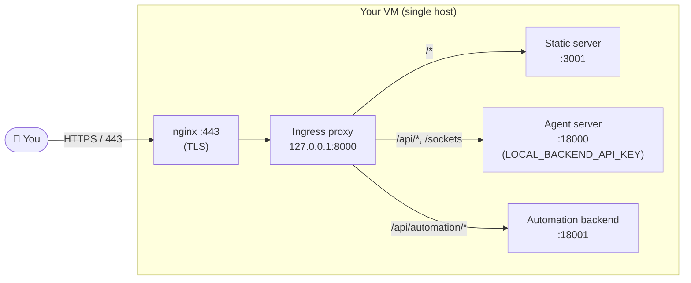

# Self-Hosting Agent Canvas on a Virtual Machine

This guide walks through running Agent Canvas on a virtual machine (VM) so you
can reach it from anywhere via a browser.

> [!WARNING]
> Agent Canvas drives an agent that can read and write the filesystem of the
> machine it runs on, execute shell commands, and reach the network. Anyone who
> can talk to the agent server can do the same. **Treat the VM as you would any
> machine that holds production credentials**, and lock it down before exposing
> it to the public internet.

## Quickstart

1. **Provision a machine** — a cloud VM or dedicated hardware (Mac Mini, NUC, etc.)
2. **Secure the machine** — lock down the network firewall
3. **Run Agent Canvas** — generate a key with `openssl rand -base64 32`, then `export LOCAL_BACKEND_API_KEY=<key>` and `npx @openhands/agent-canvas --public`
4. **(Optional) Get a domain** — point a domain at the machine with nginx + Let's Encrypt for TLS
5. **(Optional) Connect locally** — add the remote as a backend in your local Agent Canvas

## Details

The deployment model:



`npx @openhands/agent-canvas --public` spins up the static frontend server,
the agent server, and the automation backend, fronted by an ingress proxy on
`127.0.0.1:8000` that routes by path. nginx only needs to know about that
single ingress port.

The `--public` flag enables **public mode**: the API key is _not_ baked into
the frontend. Instead, users see an API key entry screen when they first load
the UI and must paste the `LOCAL_BACKEND_API_KEY` to proceed.

The defenses layered on top of this:

1. **Cloud / network firewall (step 2)** — by default nothing inbound is
   reachable except SSH from your IP. If you do step 4, you additionally open
   80 and 443 (ideally still restricted to your IP allow-list on 443).
2. **`LOCAL_BACKEND_API_KEY` + public mode (step 3)** — every `/api/*` call
   must carry a matching `X-Session-API-Key` header, and the UI requires
   users to enter the key before they can interact with the agent.

## 1. Provision a machine

Any always-on Linux (or macOS) host with a stable network connection will do:

- **A cloud VM** — DigitalOcean, AWS EC2, GCP, Hetzner, Linode, etc.
  Ubuntu 24.04 LTS is a good default. 2 vCPU / 4 GB RAM is plenty for a
  single user.
- **Dedicated hardware** — a Mac Mini, an Intel NUC, a spare laptop.
  Keep in mind that anything reachable from your LAN is part of the threat
  model.

## 2. Secure the machine

> [!IMPORTANT]
> Do this **before** you start the agent server for the first time.

The default posture should be: **nothing inbound is reachable from the public
internet** except SSH (and only from your own IP). All services bind to
`127.0.0.1` (see step 3), but the network firewall is what guarantees no one
else can reach them even if something binds wrong.

Restrict inbound traffic at the cloud-provider / network level (DigitalOcean
Cloud Firewall, AWS Security Group, GCP firewall rule, etc.):

- **Inbound 22 (SSH)** — restrict to your own IP / VPN CIDR.
- **Everything else** — drop. The ingress port (`:8000`), agent server
  (`:18000`), automation backend (`:18001`), and static server (`:3001`)
  must not be reachable from outside the host.

At this point your machine is reachable only over SSH. That's enough to run
the agent (step 3) and access the UI through an SSH tunnel. If you also want
to reach it from a browser without tunneling, you'll open ports 80 and 443
in step 4.

## 3. Run Agent Canvas

Install the prerequisites on the machine. On Ubuntu:

```bash
apt-get update
apt-get install -y curl git
# Node.js 22.x (use nvm, asdf, or NodeSource — whatever you prefer)
# uv (for the agent-server uvx runtime):
curl -LsSf https://astral.sh/uv/install.sh | sh
```

On macOS (Mac Mini, etc.) install Node and `uv` via `brew` instead.

Start Agent Canvas in public mode:

```bash
export LOCAL_BACKEND_API_KEY=$(openssl rand -base64 32)   # generate once; store securely
npx @openhands/agent-canvas --public
```

Using `export` keeps the key out of the process list (`ps aux`). The
`openssl rand -base64 32` command generates a cryptographically random
256-bit key — copy the printed value somewhere safe before proceeding.

This single command downloads the latest release, starts the agent server,
the automation backend, and the static frontend, and fronts them with an
ingress proxy on `127.0.0.1:8000`.

To keep the service running after your SSH session ends, use a process manager.

**Option A — tmux (quick):**

```bash
export LOCAL_BACKEND_API_KEY=<your-saved-key>
tmux new-session -d -s canvas 'npx @openhands/agent-canvas --public'
# Reconnect later with: tmux attach -t canvas
```

**Option B — systemd (recommended for long-term deployments):**

Create `/etc/systemd/system/agent-canvas.service`:

```ini
[Unit]
Description=Agent Canvas
After=network.target

[Service]
Environment=LOCAL_BACKEND_API_KEY=<your-key>
ExecStart=npx @openhands/agent-canvas --public
Restart=on-failure
RestartSec=5

[Install]
WantedBy=multi-user.target
```

Then enable and start the unit:

```bash
sudo systemctl daemon-reload
sudo systemctl enable --now agent-canvas
```

> [!WARNING]
> The agent server runs **directly on the host** with full access to the
> machine's filesystem, environment, and network. The firewall (step 2) and
> the `LOCAL_BACKEND_API_KEY` are what stop a stranger from getting that
> same access.

The `--public` flag means anyone who opens the UI must enter the API key
before they can use it. Without `--public`, the key is auto-injected into
the frontend (convenient for local-only use, but unsafe for a
publicly-reachable deployment).

## 4. (Optional) Get a domain and put nginx + Let's Encrypt in front

If you want to reach the UI from a browser without an SSH tunnel — for
example, from a phone or a machine you can't easily forward ports from —
point a domain at the host and front it with nginx + TLS. nginx terminates
TLS and forwards to the ingress on `127.0.0.1:8000`.

### Point a domain at the machine

Create an `A` record pointing to the machine's public IPv4 — for example
`canvas.example.com`. Verify DNS has propagated:

```bash
dig +short canvas.example.com
```

### Open ports 80 and 443

Go back to your network firewall and additionally allow inbound:

- **Inbound 80 (HTTP)** — open to `0.0.0.0/0` (required for Let's Encrypt
  HTTP-01 challenges). nginx will redirect all traffic to HTTPS.
- **Inbound 443 (HTTPS)** — restrict to your own IP / VPN CIDR if you can.
  If you need it world-open (e.g. you roam often), `LOCAL_BACKEND_API_KEY`
  is your primary defense.

### Install nginx and certbot

```bash
apt-get install -y nginx certbot python3-certbot-nginx
```

### nginx site config

Drop this at `/etc/nginx/sites-available/canvas.example.com`, replacing
`canvas.example.com` with your domain:

```nginx
server {
    listen 80;
    listen [::]:80;
    server_name canvas.example.com;

    location /.well-known/acme-challenge/ {
        root /var/www/html;
    }

    location / {
        proxy_pass http://127.0.0.1:8000;
        proxy_http_version 1.1;
        proxy_set_header Host $host;
        proxy_set_header X-Real-IP $remote_addr;
        proxy_set_header X-Forwarded-For $proxy_add_x_forwarded_for;
        proxy_set_header X-Forwarded-Proto $scheme;

        # WebSocket / SSE support — required for live agent events.
        proxy_set_header Upgrade $http_upgrade;
        proxy_set_header Connection "upgrade";
        proxy_read_timeout 3600s;
        proxy_send_timeout 3600s;
    }
}
```

Enable, test, and issue a certificate:

```bash
ln -sf /etc/nginx/sites-available/canvas.example.com \
       /etc/nginx/sites-enabled/canvas.example.com
nginx -t && systemctl reload nginx

certbot --nginx -d canvas.example.com \
    --non-interactive --agree-tos \
    --email you@example.com \
    --redirect
```

`certbot` adds the `listen 443 ssl` block, a 301 redirect from HTTP to
HTTPS, and installs a systemd timer for auto-renewal.

### Verify

```bash
curl -I https://canvas.example.com/      # → 200 (shows API key entry screen)
curl -I http://canvas.example.com/       # → 301 to https
```

If you see `502 Bad Gateway`, the app on `127.0.0.1:8000` is down — check
whether the `npx` process is still running.

Open `https://canvas.example.com/` in a browser, enter your
`LOCAL_BACKEND_API_KEY`, and confirm that you land in Agent Canvas.

## 5. (Optional) Connect your local Agent Canvas to the remote machine

If you already run Agent Canvas locally, you can register the remote machine
as an additional backend and switch between local and remote from the UI.

1. In your local Agent Canvas, open **Manage backends** → **Add a backend**:
   - **Host Name** — anything memorable, e.g. `my-vm`.
   - **Host** — the URL from step 4, e.g. `https://canvas.example.com`.
     If using an SSH tunnel instead, use `http://localhost:8000`.
   - **Session API key** — the `LOCAL_BACKEND_API_KEY` you chose in step 3.
2. Save. The new backend should show as "Connected". Pick it from the
   backend switcher to talk to the remote machine.

## 6. (Optional, advanced) Put UI extensions on their own subdomain

> **Do you need this? Almost certainly not — skip it.**
>
> UI extensions are already locked down automatically. Each one runs inside a
> **sandboxed frame** with **no access** to your data, your login session, or
> the network — the extension's code literally cannot "phone home" or read
> anything outside its own little box. This protection is always on and needs
> **zero configuration**.
>
> You also don't host extension files yourself in the normal case: when you
> add an extension, your browser downloads it straight from wherever it lives
> (for example, a public GitHub link). Your server is never in the middle, so
> there is nothing for you to set up.

**This section applies to exactly one situation:** you run your *own* private
catalog of in-house extensions and want to serve those files **from your own
Agent Canvas machine**. If that's not you, stop here — you're already done.

### Why bother (the one extra benefit)

Serving extension files from a **separate web address** (a subdomain like
`extensions.canvas.example.com`) adds one more safety layer: even in the
extremely unlikely event a web-browser bug let an extension break out of its
sandbox, it would land on a throwaway domain that holds *nothing* — not on the
domain that carries your login session. It's a "belt and suspenders" measure,
not a requirement.

### How to set it up

1. **Add a second DNS record** for the subdomain, pointing at the same machine
   (just like the `A` record in step 4):

   ```bash
   dig +short extensions.canvas.example.com   # should show your machine's IP
   ```

2. **Put your extension files** in a folder on the machine, e.g.
   `/var/www/canvas-extensions/`, with each extension in its own subfolder
   containing its `extension.json` and assets.

3. **Add an nginx server block** for the subdomain. It serves the files and
   attaches the security headers. Two values must point back at your **main**
   site: `frame-ancestors` (so only your Agent Canvas may embed the
   extensions) and `Access-Control-Allow-Origin` (so your app is allowed to
   read the extension's `extension.json`). Replace both `…example.com` names
   with yours:

   ```nginx
   server {
       listen 80;
       listen [::]:80;
       server_name extensions.canvas.example.com;
       root /var/www/canvas-extensions;

       location /.well-known/acme-challenge/ {
           root /var/www/html;
       }

       location / {
           add_header X-Content-Type-Options "nosniff" always;
           add_header Access-Control-Allow-Origin "https://canvas.example.com" always;
           add_header Content-Security-Policy "default-src 'none'; script-src 'unsafe-inline'; style-src 'unsafe-inline'; img-src data: blob:; font-src data:; connect-src 'none'; form-action 'none'; base-uri 'none'; frame-ancestors https://canvas.example.com; sandbox allow-scripts" always;
       }
   }
   ```

4. **Get a certificate** for the subdomain, exactly as in step 4:

   ```bash
   ln -sf /etc/nginx/sites-available/extensions.canvas.example.com \
          /etc/nginx/sites-enabled/extensions.canvas.example.com
   nginx -t && systemctl reload nginx

   certbot --nginx -d extensions.canvas.example.com \
       --non-interactive --agree-tos --email you@example.com --redirect
   ```

5. **Install from the subdomain.** When you add an extension in the UI, use its
   `https://extensions.canvas.example.com/<name>` address. Your main site and
   your extensions now live on separate origins.

> **One caveat (safe to ignore).** Agent Canvas's built-in dev server gives
> each extension page a one-time `script-src` *nonce* — the strongest form of
> the script lock. A plain static nginx site can't mint a fresh nonce per
> request, so the header above keeps the slightly looser `'unsafe-inline'`.
> That is still safe here because the frame is sandboxed and has `connect-src
> 'none'` (no network). Restoring nonces would require a small dynamic asset
> server; the building blocks (`buildWebviewCsp` / `stampCspNonce`) live in
> `src/extensions/webview-security.ts`.
